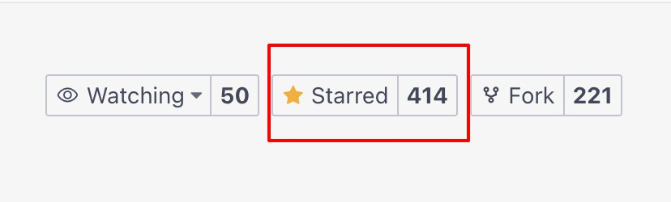

# 启航电商ERP系统微信小店版

## 一、项目概述

启航电商微信小店电商ERP系统是一套为专为微信小店开发的一套电商业务系统，支持多店铺管理。

主要功能：
+ 采购管理：采购下单、采购入库、采购费用记账等。
+ 订单管理：店铺订单同步、备注。
+ 发货管理：拣货出库、打包发货、物流跟踪、物流费用记账。
+ 售后管理：店铺售后同步、售后处理（补发商品、换货、退货）。
+ 库存管理：采购入库、发货出库、退货入库、库存明细。
+ 电子面单打印：订单发货打印。

完整基本覆盖微信小店电商业务处理完整流程。**后续将拓展会员、营销等功能，助力公域私域电商运营**

系统后端采用Springboot3开发，前端采用Vue2+Element开发。


**不能使用admin超级管理员账号进行业务操作，业务操作需要使用子账号进行。**

## 二、功能列表
### 订单管理
#### 1、订单查询
+ 订单搜索： 管理已确认过的订单。
+ 订单详情：查看订单详情。
+ 手动关联订单商品（个别订单需要手动关联）
+ 添加订单赠品。
+ 选择订单发货方式（仓库发货、供应商发货）

#### 2、网店订单同步
+ API拉取订单： 使用微信视频号平台接口拉取店铺订单，支持多店铺。
+ 更新订单状态：可以单个更新订单状态，也可以批量更新订单状态。
+ 批量确认订单：批量确认订单，确认之后的订单才会入订单库。（确认订单会自动将店铺商品和ERP商品关联）

### 发货管理
#### 1、备货清单
+ 仓库发货备货清单：查看仓库发货需要备货的商品明细。
+ 供应商发货备货清单：查看需要供应商发货的商品明细。

#### 2、打包发货
选择店铺、订单号、快递公司、快递单号，进行发货处理。后续可以跟踪物流信息。

#### 3、快递公司管理
管理发货快递公司。

### 售后管理
#### 1、售后管理
+ 同步店铺售后数据，支持多店铺
+ 退货签收
+ 订单拦截
+ 补发处理
+ 换货处理

#### 2、订单拦截管理
订单拦截查询、入库、管理。

#### 3、退货管理
退货查询、入库、管理。

#### 4、换货管理
换货查询、入库、出库、管理。

#### 5、补发管理
补发查询、出库、管理。

### 店铺管理
#### 1、店铺商品管理
管理店铺的商品，使用微信视频号平台接口获取商品数据。

#### 2、店铺管理
对视频号小店进行管理，支持多店铺。

### 商品管理
#### 1、商品管理
对商品进行管理，维护：供应商、SKU、价格等信息。

#### 2、商品SKU管理
查询、维护商品SKU。

#### 3、商品分类管理
查询、维护商品分类。

#### 4、供应商管理
查询、维护供应商信息。

## 三、技术框架
**后端采用：**
+ Java 17
+ SpringBoot3.x

**数据库采用：**
`MySql`

**缓存采用：**
`Redis`

**前端采用**
+ vue2
+ element

## 四、功能列表TODO

| 模块   | 菜单      | 功能   | 完成  |
|------|---------|------|-----|
| 采购管理 | 采购单管理   | 列表   | 进行中 |
| 采购管理 | 采购单管理   | 入库   |  进行中   |
| 采购管理 | 采购物流管理  |      |  进行中   |
| 采购管理 | 采购账单管理  |      |     |
| 采购管理 | 代发账单管理  |      |     |
| 采购管理 | 供应商管理   |      | ✅   |
| 订单管理 | 订单管理    | 列表   |     |
| 订单管理 | 订单管理    | 审核   |     |
| 订单管理 | 网店订单导入  |      |     |
| 发货管理 | 备货清单    |      |     |
| 发货管理 | 拣货出库    |      |     |
| 发货管理 | 打包发货    |      |     |
| 发货管理 | 发货记录    |      |     |
| 发货管理 | 快递公司管理  |      | 需完善 |
| 售后管理 | 售后处理    | 列表   |     |
| 售后管理 | 售后处理    | 处理   |     |
| 售后管理 | 店铺售后导入  |      |     |
| 售后管理 | 订单拦截    |      |     |
| 售后管理 | 订单退货    |      |     |
| 售后管理 | 订单换货    |      |     |
| 售后管理 | 订单补发    |      |     |
| 库存管理 | 入库管理    |      |     |
| 库存管理 | 出库管理    |      |     |
| 库存管理 | 库存查询    |      |     |
| 库存管理 | 仓位管理    |      |     |
| 店铺管理 | 店铺商品管理  |      | 需完善 |
| 库存管理 | 店铺管理    |      | ✅   |
| 商品管理 | 商品管理    |      | ✅   |
| 商品管理 | 商品SKU管理 |      | ✅   |
| 商品管理 | 商品分类管理  |      | ✅   |
| 商品管理 | 商品分类管理  | 分类属性 | ✅   |
| 商品管理 | 商品品牌管理  |  | ✅   |
## 五、部署说明


### 5.1 项目打包

+ 后端打包:进入`api`文件夹下运行`mvn clean package`
+ 前端打包:进入`vue`文件夹下运行`npm run build:prod`

### 5.2 启动后端
+ 创建数据库`qihangerp-weishop`并导入sql脚本(`db\qihangerp-weishop.sql`)

+ 启动jar：`java -jar api-3.0.2.jar`

### 5.3 启动前端
+ 下载解压Nginx
+ 配置Nginx
    ```
      server {
        listen       80;
        server_name  localhost;
        charset utf-8;

        location / {
            root   ../dist; #前端打包后的dist文件夹
            try_files $uri $uri/ /index.html;
            index  index.html index.htm;
        }
        
        location /prod-api/ {
            proxy_set_header Host $http_host;
            proxy_set_header X-Real-IP $remote_addr;
            proxy_set_header REMOTE-HOST $remote_addr;
            proxy_set_header X-Forwarded-For $proxy_add_x_forwarded_for;
            proxy_pass http://localhost:8099/;
        }

        error_page   500 502 503 504  /50x.html;
        location = /50x.html {
            root   html;
        }
    }
  ```
+ 启动Nginx
+ 超级管理员账户：`admin`:`admin123`
+ 子账号：`qihang`:`admin123`

## 五、支持一下

**感谢大家的关注与支持！希望利用本人从事电商10余年的经验帮助到大家提升工作效率！**

### 5.1 赠人玫瑰手留余香
💖 如果觉得有用记得点个 Star⭐



### 5.2 一起交流

💖 欢迎加入知识星期获得作者帮助和朋友们一起交流！

+ 微信公众号


+ 知识星球

   


### 5.3 捐助作者
作者为兼职做开源,平时还需要工作,如果帮到了您可以请作者吃个盒饭


